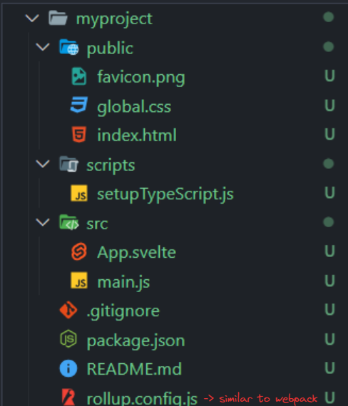

# [Notes] Svelte Tutorial for Beginners - NetNinja

# Setting up a Svelte App

## Setup:

- Install degit to clone updated repository from GitHub or instead use Git commands.

```
npm install -g degit
```

- Use `degit` to clone Svelte template from Sveltejs github repository onto the working directory.

```
degit sveltejs/template myproject
```

- This clones the following starter files:



- Install the packages within the project using `npm install`, to run the application use: `npm run dev`
