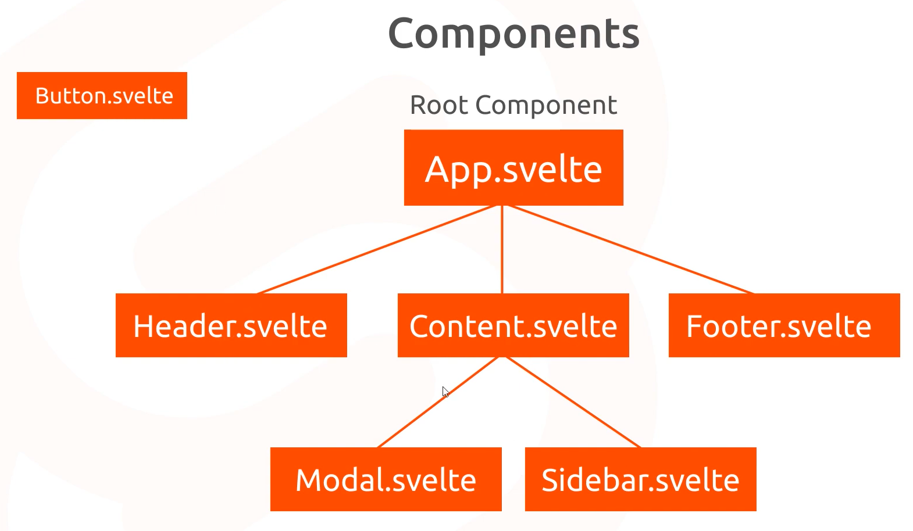

# [Notes] Svelte Tutorial for Beginners - NetNinja

# Svelte - Components



- To render the components, the component must be imported on its parent components.

```svelte
/* App.svelte */
<script>
/* imports the component */
  import Button from './Button.svelte' 
</script>

/* renders the component */
<Button/> 
```
